  

<h3><code>divansh@github ~ $ whoami</code></h3>

<table>
  <tr>
    <td valign="top"></td>
    <td valign="top"></td>
  </tr>
</table>

 

<h3><code>divansh@github ~ $ ./deploy --global</code></h3>

<table>
  <tr>
    <td valign="top"></td>
    <td valign="top"></td>
  </tr>
</table>

 

<h3><code>divansh@github ~ $ ./skyline --3d</code></h3>

  

<h3><code>divansh@github ~ $ ./contributions.sh</code></h3>

  

<h3><code>divansh@github ~ $ ./snake --eat-commits</code></h3>

  

Every SVG here is generated by Python in <a href="./scripts"><code>scripts/</code></a> and refreshed daily by GitHub Actions. No external image services. Want one? <a href="./SETUP.md">Build your own</a>.

